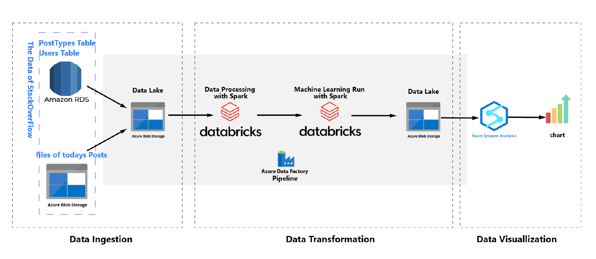

# Project Overview
This is is a **Big Data** Engineering Project on Azure. Data is ingested from 2 data sources (PostgreSQL and Blob Storage) and ingested into the Data Lake in Azure. In the Data Lake, after a couple of data transformation and Machine Learning Model running, I made the Machine Learning result back to the Data Lake. Then I used Azure Synapse connected to the DataLake and generated a report from the Synapse.
# Project Architecture Diagram

# Project Steps
### 1- Data Ingestion:
In this part, I have 2 data sources to connect, the Postgres database and the Azure blob container. I used Azure Data Factory connect to those.
### 2- Data Transformation:
The transformation process happens in the Azure Databricks. I created a Databricks notebook and run data transformation and Machine Learning models on the data. The output result is used for the BI dashboards in the next step.
### 3- Data Visualization:
In the last part, I used Synapse connect to the data lake to generate a chart which can display to top 10 topics in the posts.
# Project Outcomes
In this Azure Big Data Engineering Project, I successfully integrated data from PostgreSQL and Blob Storage into Azure Data Lake, facilitating efficient storage and transformation. I also executed Machine learning models in Databricks and generated valuable insights, with results seamlessly incorporated back into the Data Lake. This project exemplifies the effectiveness of Azure services in building a scalable and powerful big data infrastructure.
